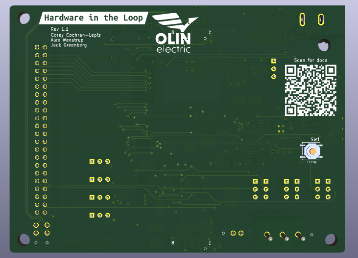

Testing and debugging PCBs can be challenging. There are lots of resource you
need, including the schematic, documentation, data sheets, and more. Hunting all
of this information down can be a pain. It would be great if there was a way to
collect all this information in one place and make it easily accessible...

Imagine this: a QR code on the back of your PCB. You scan it, and it brings up a
list of links including your schematic, documentation, important datasheets,
[interactive HTML BoM], or whatever else you want. Well, it's actually quite
easy.

[interactive HTML BoM]: https://github.com/openscopeproject/InteractiveHtmlBom

## Adding the QR Code

Adding a QR Code is actually very simple.

1. From your layout editor, open the Footprint Editor
2. Choose "Create a new footprint using the Footprint Wizard"
3. When selecting from "Wizards", choose the "2D Barcode QRCode"
4. Add your link to the "Content" section
5. Deselect "Use Cu layer" and select "Use SilkS layer"
6. Click "Export footprint to editor"
7. Click "Insert footprint into current board"
8. Place your QR code!

This video shows the full walkthrough:

<video width="100%" controls>
  <source src="images/kicad.mp4" type="video/mp4">
Your browser does not support the video tag.
</video> 

---

Hopefully this inspires you to make your PCB designs a bit more accessible. I
know that I'll start using this on every board I design moving forward.
